# EndemikDB - Aplikasi Ensiklopedia Hewan & Tumbuhan Endemik

Aplikasi Android berbasis Java yang berfungsi sebagai ensiklopedia digital untuk mendata hewan dan tumbuhan endemik di Indonesia. Project ini dibuat untuk memenuhi tugas **Ujian Akhir Semester (UAS) Praktikum Pemrograman Mobile**.

## 👤 Identitas Pengembang
* **Nama:** Razky Ega Handaru
* **NIM:** 2410501063
* **Kelas:** B
* **Prodi:** D3 Sistem Informasi

---

## 🚀 Fitur Utama Aplikasi
1. **Bottom Navigation & Fragments:** Memisahkan konten dengan rapi menjadi 3 bagian utama (Hewan, Tumbuhan, dan Profil Mahasiswa).
2. **Modern Grid CardView:** Tampilan daftar yang responsif menggunakan `RecyclerView` dengan gaya Grid 2 kolom yang rapi dan adaptif terhadap tema HP (*Light/Dark Mode*).
3. **Real-time Search:** Fitur pencarian cepat dan responsif berdasarkan nama lokal maupun nama taksonomi latin yang menyaring data dari database secara langsung.
4. **Detail Screen:** Menampilkan informasi taksonomi ilmiah secara lengkap (*Famili*, *Genus*, dan *Nama Latin*) menggunakan *badge* visual yang elegan, serta dilengkapi tombol *back* mengambang yang estetik.
5. **Sistem Favorit (Dual-Table Schema ROOM):** Menggunakan arsitektur database relasional dengan 2 tabel terpisah (`endemik_table` & `favorit_table`) yang dihubungkan melalui query `INNER JOIN` untuk menyimpan data pilihan pengguna secara permanen.
6. **Multi-Language Support (Localization/Region):** Aplikasi mendukung penuh perubahan bahasa sistem (*Locale*) antara Bahasa Indonesia (ID) dan Bahasa Inggris (EN) secara dinamis pada seluruh teks UI statis dan notifikasi.

---

## 🛠️ Tech Stack & Arsitektur
* **IDE:** Android Studio
* **Language:** Java
* **Database:** ROOM Database (SQLite wrapper)
* **Image Loading:** Glide Library
* **UI/UX Components:** ScrollView, FrameLayout, RelativeLayout, Material Design Components

---

## 📸 Tangkapan Layar (Screenshots)

### Versi 1: Region Indonesia (Bahasa Indonesia)

|                  Splash Screen (Loading)                   |                Splash Screen (Data Ready)                |
|:----------------------------------------------------------:|:--------------------------------------------------------:|
| 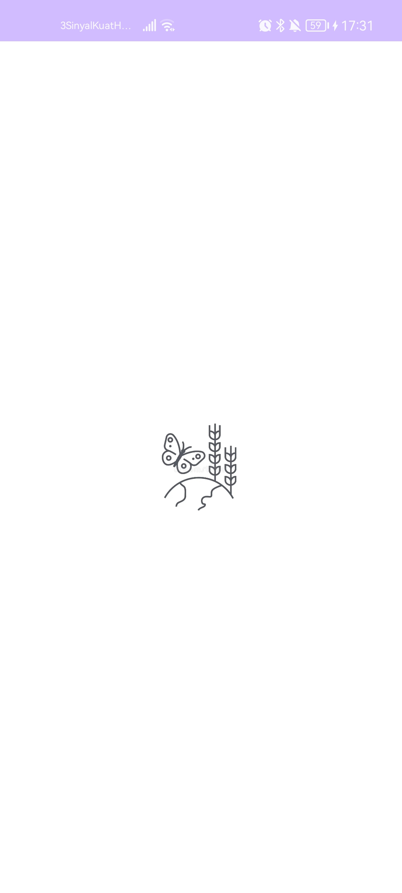 | 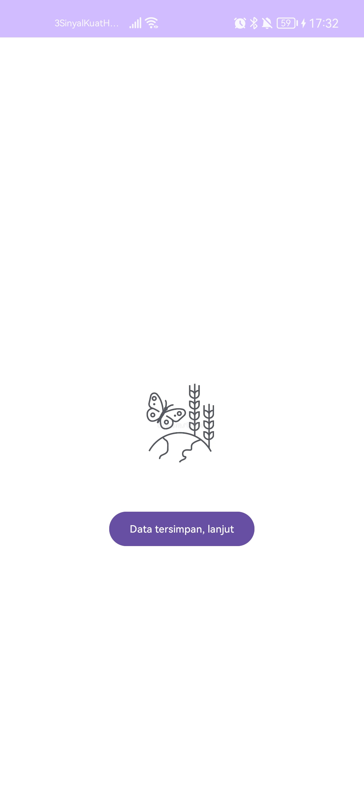 |

|                   Layar Utama: Hewan                   |                   Layar Utama: Tumbuhan                   |                   Layar Utama: Profil                   |
|:------------------------------------------------------:|:---------------------------------------------------------:|:-------------------------------------------------------:|
| 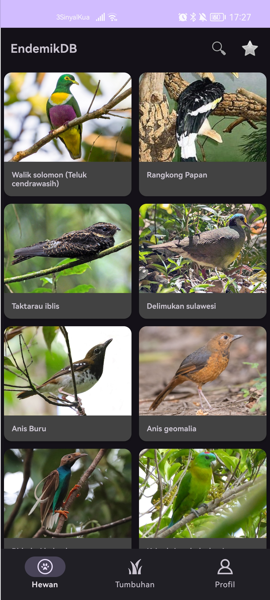 | 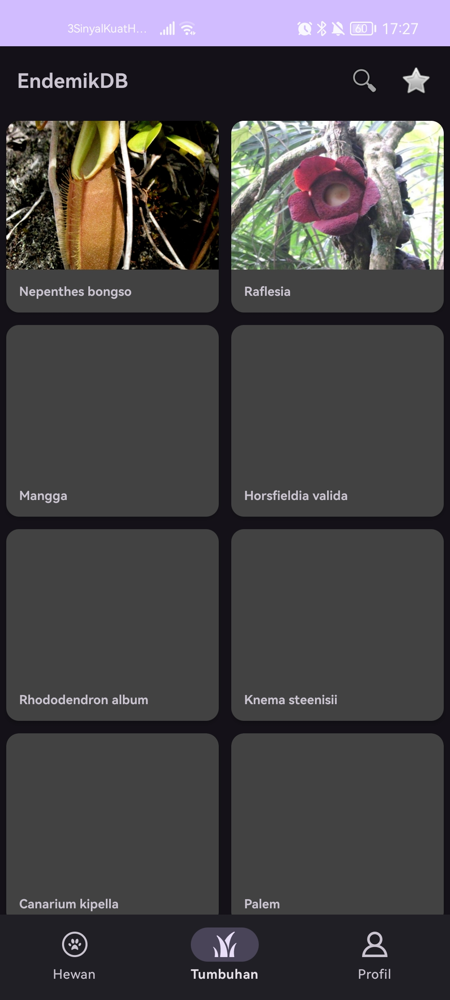 | 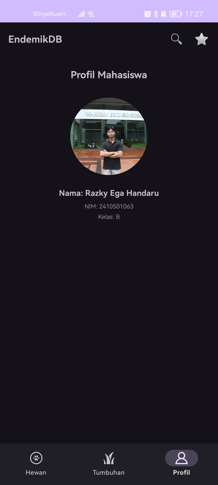 |

|              Layar Pencarian (Search)              |                 Layar Detail Objek                 |                 Layar Favorit Saya                  |
|:--------------------------------------------------:|:--------------------------------------------------:|:---------------------------------------------------:|
| 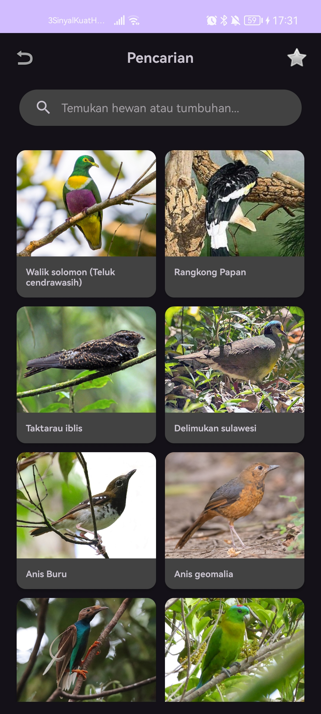 | 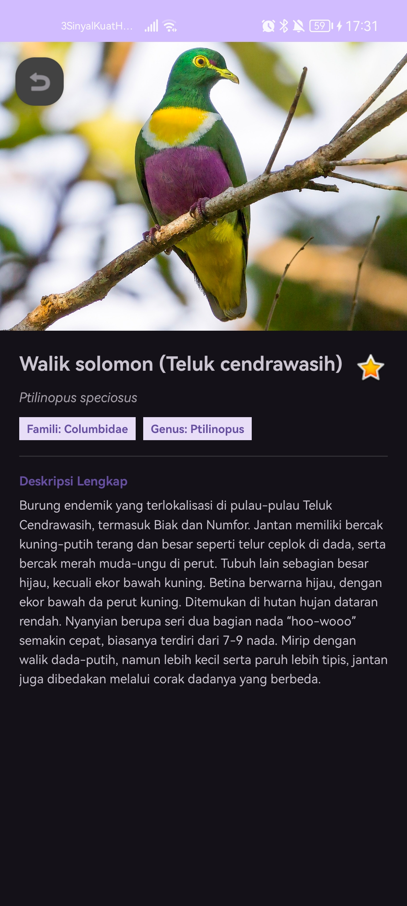 | 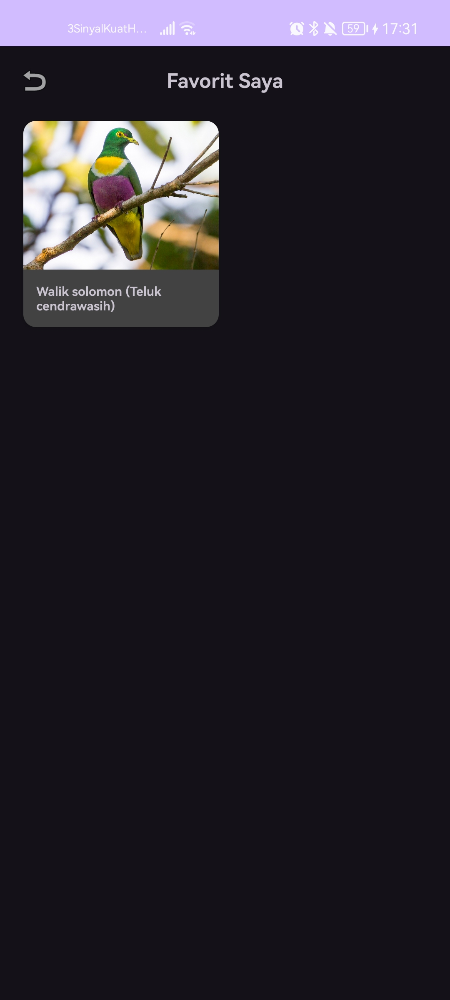 |

---

### Versi 2: Region Global (English)

|                  Splash Screen (Loading)                   |                Splash Screen (Data Ready)                |
|:----------------------------------------------------------:|:--------------------------------------------------------:|
|  | 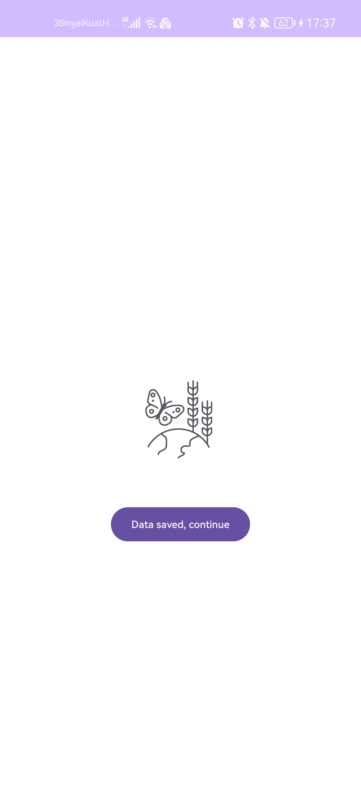 |

|                  Main Screen: Animals                  |                    Main Screen: Plants                    |                  Main Screen: Profile                   |
|:------------------------------------------------------:|:---------------------------------------------------------:|:-------------------------------------------------------:|
|  |  |  |

|                   Search Screen                    |                Object Detail Screen                |                 My Favorites Screen                 |
|:--------------------------------------------------:|:--------------------------------------------------:|:---------------------------------------------------:|
| 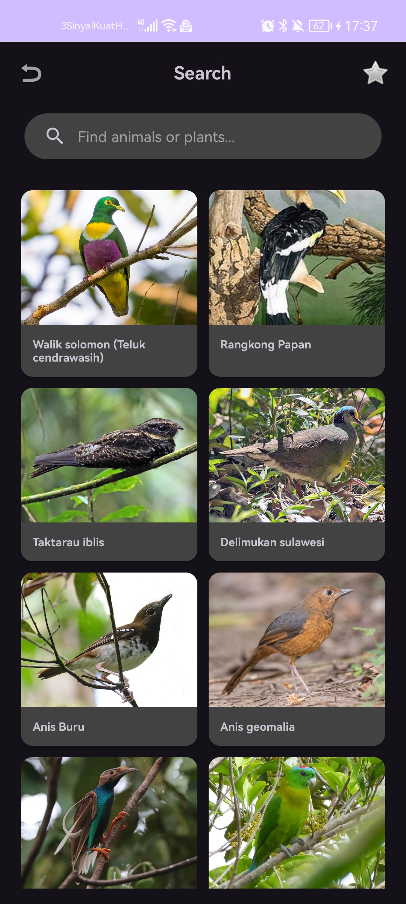 | 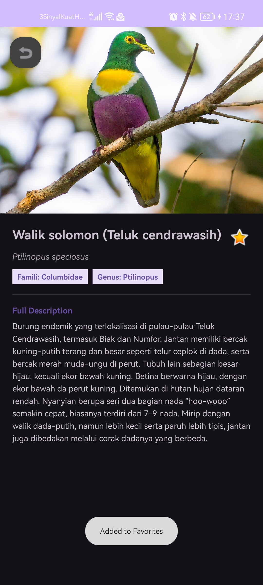 |  |